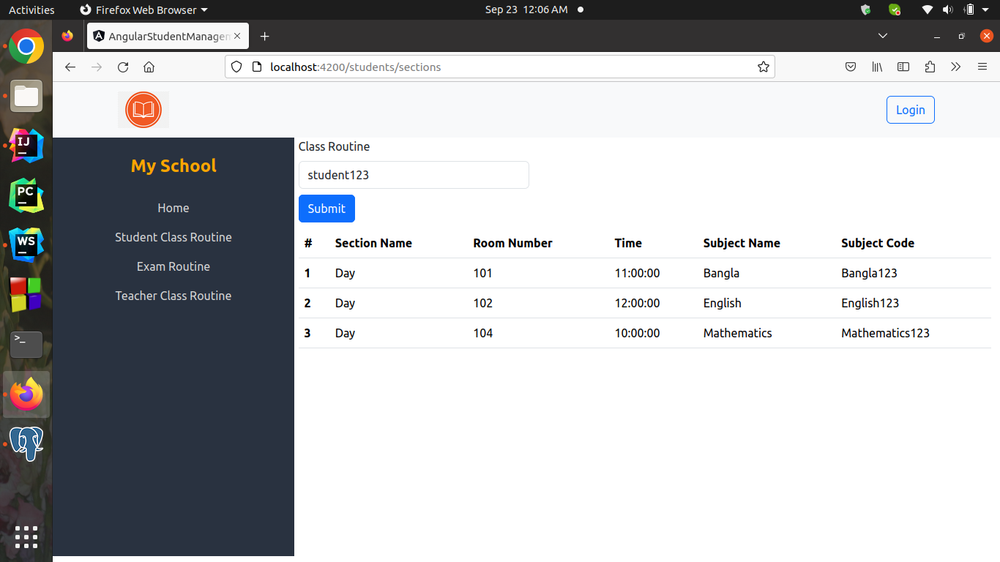

# Spring Boot + Angular Student Management Project REST API

- Java 17
- Spring Boot
- PostgreSQL
- Angular 15.2.0 (install npm)
- Bootstrap
- Spring Security
- JWT Authentication
- Multiple Role-Based Authentication
- In this section describe very short description about this project

- Admin: username: admin123, password: admin123
- Student: username: student123, password: student123
- Teacher: username: teacher123, password: teacher123
### Home Page 

Student Class routine, Exam Routine, Teacher Class routine any one will see there Username

### Login Form
Student, Teacher, Admin will login using there username and password

### Admin Dashboard
Admin Dashboard and admin can be access this module

### Add new Student

### Success Alert
Student or any other information saved then succees alert

### Add new Teacher

### Add new Classroom

### List of Classroom

### Add new Subject
 

### Add new Sections
 
 
### List of Sections
 
 
### Add Exam Routine
 
 
### Student or Teacher will see there Class Routine
 
 
### Student will see class routine
 
 

